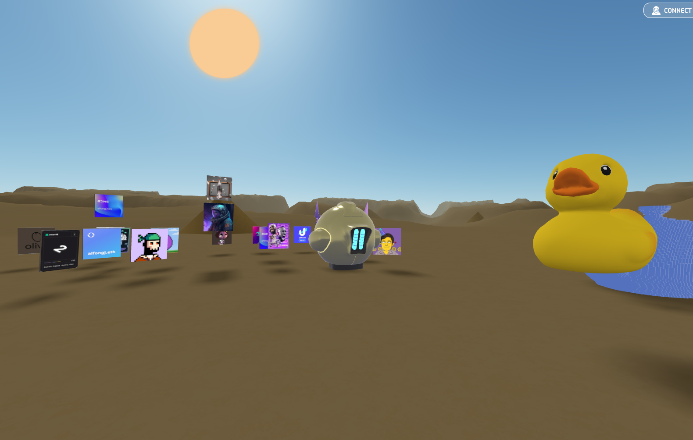
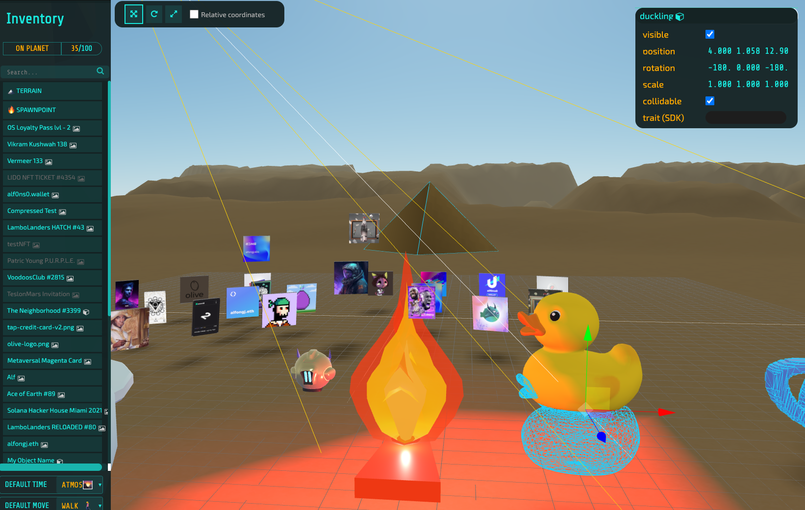
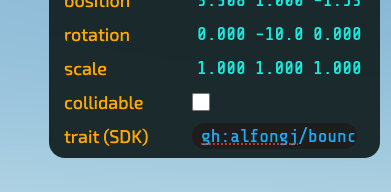

# Tutorial: Adding a trait to objects in your Desolate Planet

Traits are "behaviors" that can be attached to any item in a Desolate planet. They can be used to add interactivity, animations, sounds, and more to your objects.

If an NFT is minted with a trait preloaded, it should just work!

But you can also add traits directly from your planet editor. To do so follow the instructions below:

## 1. Find the trait you want to add

At this time, traits are all hosted in Github. They can be found in [this folder](https://github.com/desolatenft/intergalactic-sdk/tree/main/traits/).

**Please note**: As the SDK has just been released, the list of traits is limited. As the community contributes more traits, this list will grow.



## 2. Add the trait to your objects

Go to your planet at www.desolate.space/planet/&lt;planetNumber&gt; and click the magic command (6+9), to open the planet editor.



Once open, click on the item you wish to edit. You will notice a field named "trait (SDK)". This is where you can add the trait you want to use.

## 3. Adding the trait locator

Traits have the following format:

```gh:<folder_name>```

Example:
    
    ```gh:alfongj/bounce/1.0.0```
    ```gh:desolatenft/pulse/1.0.0```

Copy the folder you got from step 1, and paste it in the trait field of the item you want to edit, and be careful to follow that format.



## 4. Save your changes

Click Save and enjoy your new trait!
